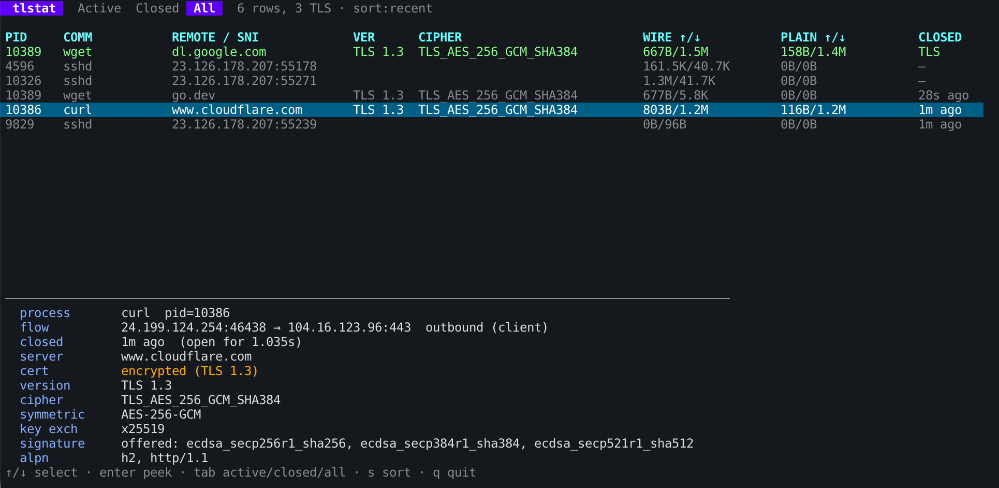
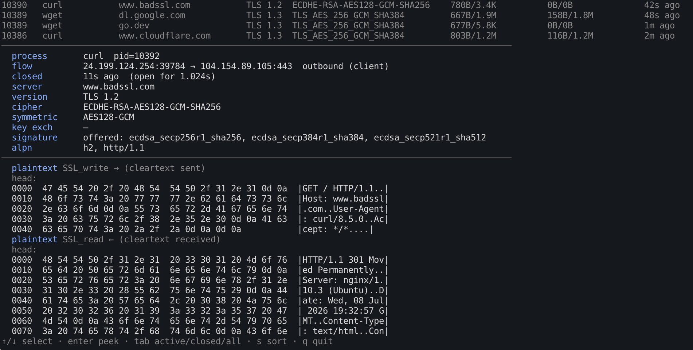

# tlstat

A live, `htop`-style terminal monitor for TLS handshakes and connections on a
Linux host, built with eBPF. It discovers TLS sessions (new and pre-existing),
parses the handshake for endpoints, server identity, and negotiated crypto,
counts bytes in/out live, and — for OpenSSL applications — captures the
**cleartext before encryption**, the one vantage point where plaintext exists.




```
 tlstat — 6 connections, 3 TLS   sort:recent
PID     COMM           REMOTE / SNI             VER      CIPHER                         WIRE ↑/↓        PLAIN ↑/↓       ST
423491  openssl        example.com              TLS 1.3  TLS_AES_256_GCM_SHA384         1.6K/6.4K       37B/874B       TLS
...
  process       openssl  pid=423491
  flow          10.0.0.5:51234 → 93.184.x.x:443  outbound (client)
  server        example.com
  version       TLS 1.3
  cipher        TLS_AES_256_GCM_SHA384
  symmetric     AES-256-GCM
  key exch      x25519
  signature     offered: ecdsa_secp256r1_sha256, rsa_pss_rsae_sha256
  ─────────────────────────────────────────────────────────
  plaintext SSL_write → (cleartext sent)
    0000  47 45 54 20 2f 20 48 54 54 50 2f 31 2e 31 0d 0a  |GET / HTTP/1.1..|
```

## How it works

Two eBPF attachment strategies, fused into one connection table:

- **Wire observation** — kprobes on `tcp_sendmsg`/`tcp_recvmsg` count bytes and
  capture the first chunks of each direction; a tracepoint on
  `inet_sock_set_state` tracks connection lifecycle. The captured bytes are
  reassembled and parsed in userspace to recover the cleartext ClientHello
  (SNI, offered ciphers, signature algorithms, ALPN) and ServerHello
  (negotiated version, cipher, key-exchange group). On **TLS 1.2** the
  Certificate message is also cleartext, so the server cert (CN, SANs,
  signature algorithm) is extracted too.
- **Library observation** — uprobes on `SSL_write`/`SSL_read` in `libssl.so`
  capture the plaintext an application hands to (or receives from) OpenSSL.
  This is the only way to see decrypted content; it works for dynamically
  linked OpenSSL programs and attaches to already-running processes.

Everything is keyed by the kernel `struct sock *`; plaintext is correlated back
to a connection via `SSL_set_fd` and `/proc/<pid>/fd` → `/proc/net/tcp`.

## Build & run

Requires a Linux kernel with BTF (`/sys/kernel/btf/vmlinux`), ~5.8+.

```sh
make deps      # clang, llvm, libelf-dev, libbpf-dev (Debian/Ubuntu)
make build     # compile eBPF (CO-RE) + Go binary
sudo ./tlstat  # must be root: eBPF needs CAP_BPF/CAP_SYS_ADMIN
```

Keys: `↑/↓` select · `enter` peek plaintext · `s` cycle sort · `q` quit.

Flags: `--libssl PATH` (override the OpenSSL library), `--interval DUR` (poll
rate), `--dump DUR` (headless text mode, e.g. `--dump 10s`, for scripting/CI).

## What it can and can't see

- **TLS 1.3 hides the server certificate on the wire.** SNI (always cleartext)
  is used as the primary server identity; the full certificate is recovered
  only on TLS 1.2. TLS 1.3 rows show `cert: encrypted`.
- **Cleartext capture is OpenSSL-only in this version.** GnuTLS, NSS, BoringSSL,
  and Go's in-binary `crypto/tls` are not yet instrumented.
- **Pre-existing connections** (established before tlstat started) missed their
  handshake, so crypto/SNI show as unknown / `pre-existing`. Byte counts still
  work, and plaintext works from the moment the uprobe attaches.
- Handshake reassembly is best-effort from the first ~16 KB per direction;
  fields past a truncation point may be unknown.
- Encrypted ClientHello (ECH) would hide SNI — rare today.

## Layout

```
bpf/tlstat.bpf.c      eBPF programs (kprobes, tracepoint, uprobes)
bpf/tlstat.h          structs shared with Go
internal/loader/      eBPF load/attach + ring buffer + map snapshots
internal/tlsparse/    TLS record/handshake parser + IANA name tables
internal/model/       connection table, correlation, plaintext join
internal/ui/          bubbletea TUI
main.go               entrypoint (root check, wiring, headless dump)
```
